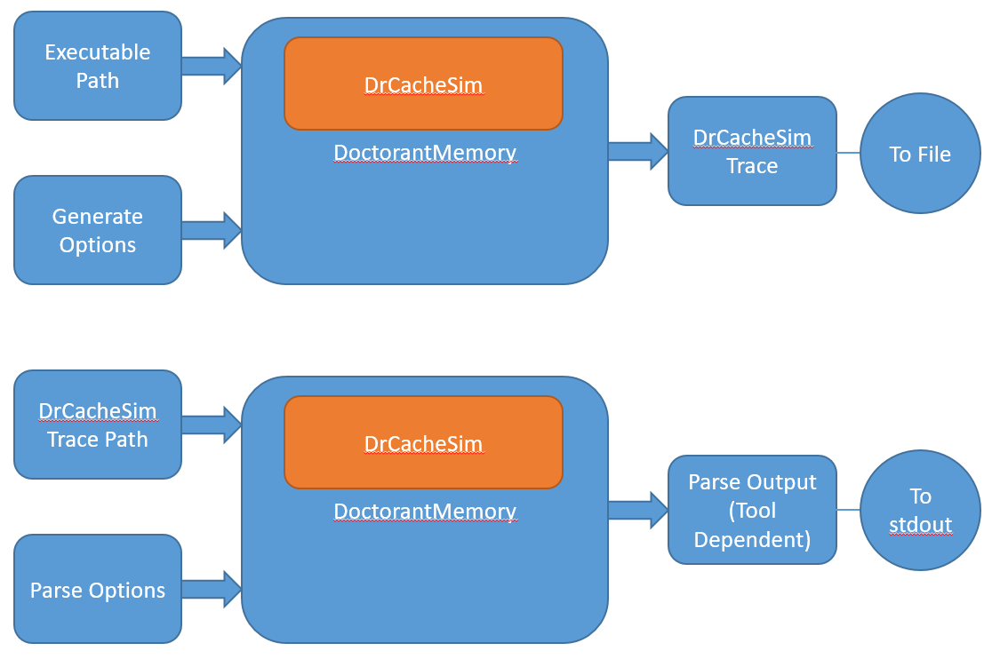

# Examples

You can use the -h flag for help:

```
doctorant_memory.py -h
```



## Getting a Trace

If you are interested in generating your own trace, we have included an example "Hello World!" application in C. 
Before running it, you should compile it with gcc.

```commandline
gcc main.c -o HelloWorld
```

Afterwards, you can generate you own trace using:
```commandline
python ./doctorant_memory.py -operation generate -app_path examples/HelloWorld
```

DoctorantMemory then creates a file named DOCTORANT_MEMORY_TS, with TS being an iso timestamp of the time the trace was created, for example: DOCTORANT_MEMORY_20240410T143504Z. This file contains the output of the executable, which is also printed to the console. 
This file is automatically deleted, if you would like to keep it, you can use the -keep_logs flag. 
The trace information is written to a folder created by drcachesim in the current working directory. 
The folder is named by drcachesim, for example: drmemtrace.HelloWorld.exe.17564.4748.dir. You can set the path where the folder would be created, with missing folders created if needed:

 ```
python .\doctorant_memory.py -operation generate -app_path ./HelloWorld.exe -trace_path traces
```

The folder traces would be created if it does not exist, as well as any more needed folders.
We have also included the trace output in this folder, in the "example trace" folder, in case you are having troble 
generating your own trace.

## Parsing a Trace

Once you have a trace, you can parse it. The output of is determined by which tool you use. By default, a cache 
simulator tool is used, showing how much of the cache is occupied, the cache levels etc. 
```commandline
python ./doctorant_memory.py -operation parse -trace_path examples/example_trace
```

To select a different tool, you can use the -parse_tool_name option:

```commandline
python ./doctorant_memory.py -operation parse -trace_path examples/example_trace -parse_tool_name memory_accesses
```

Your drmemtrace folder could have a different name, so make sure to change it if needed. 
The default parsing tool shows a cache simulation with hits, misses, etc. 
You can use other avaliable tools, for example:

```
python .\doctorant_memory.py -operation parse -trace_path traces\drmemtrace.HelloWorld.exe.02752.5578.dir -parse_tool_name cache_line_histogram
```